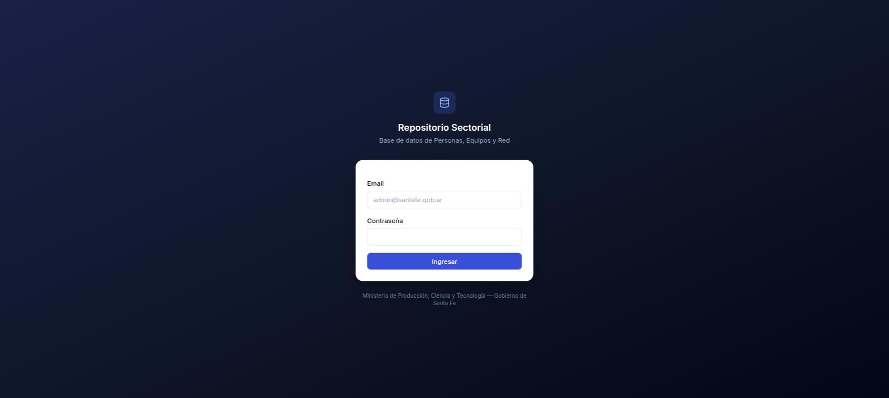
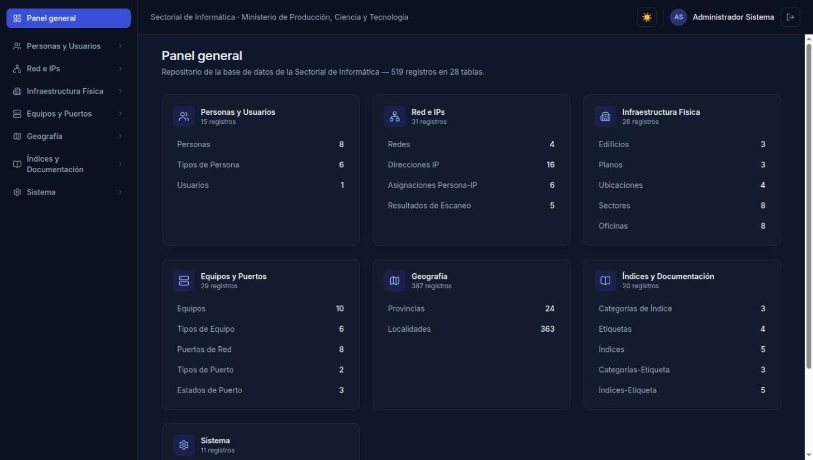
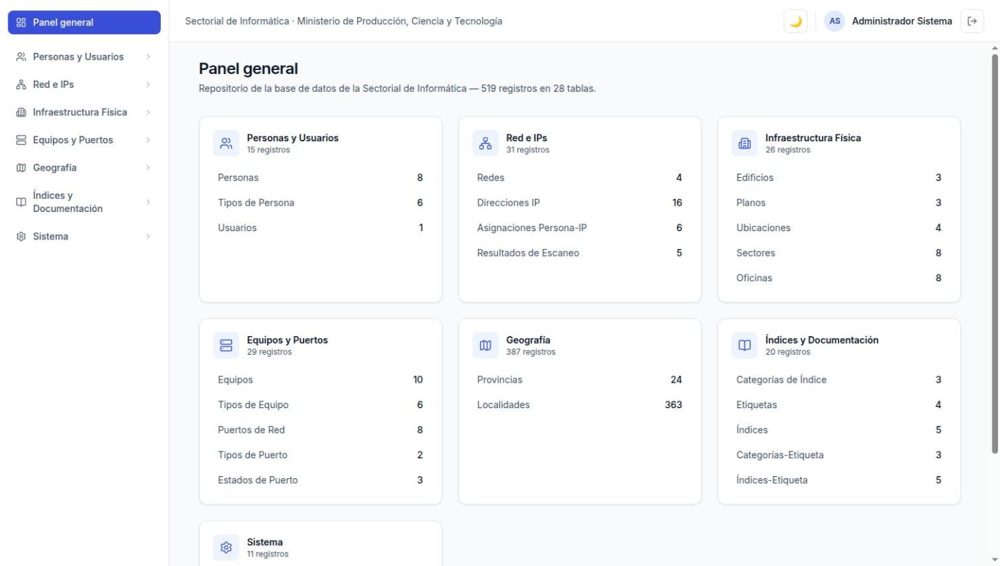
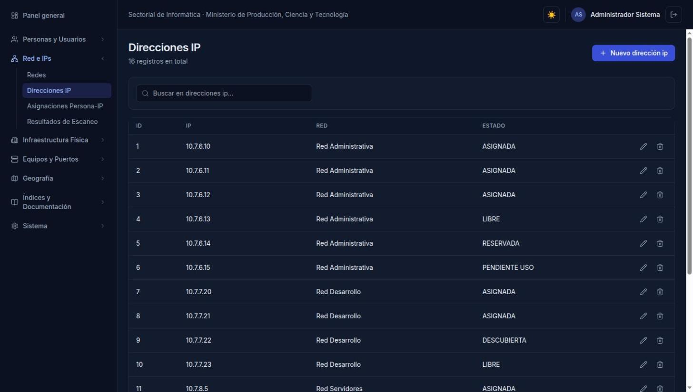
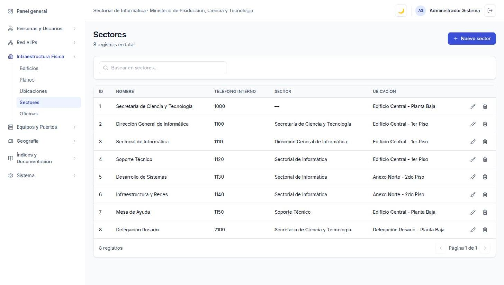
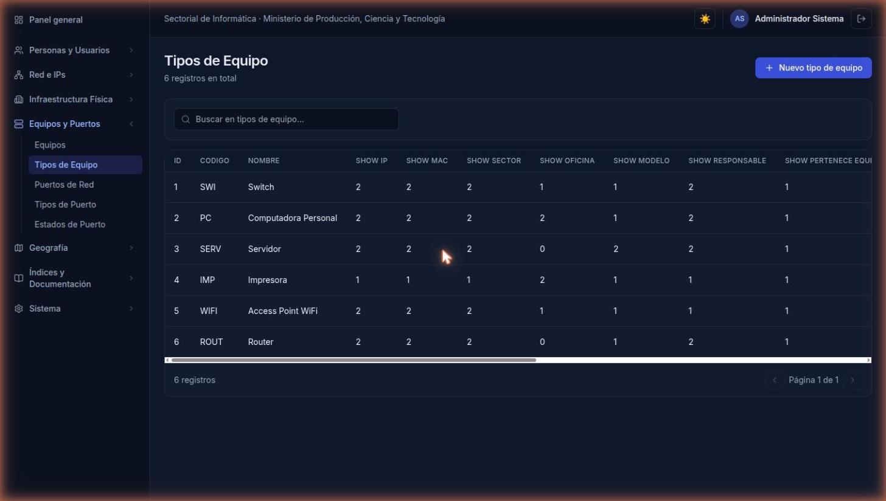
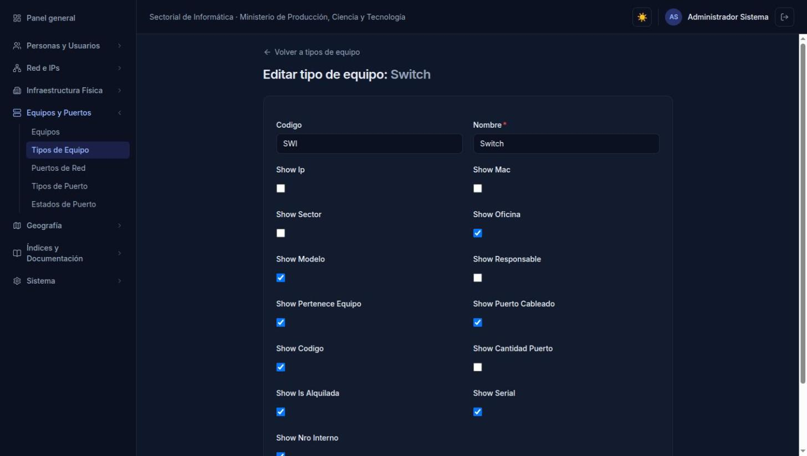
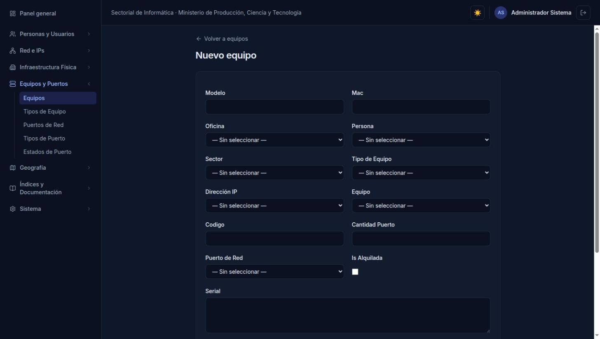
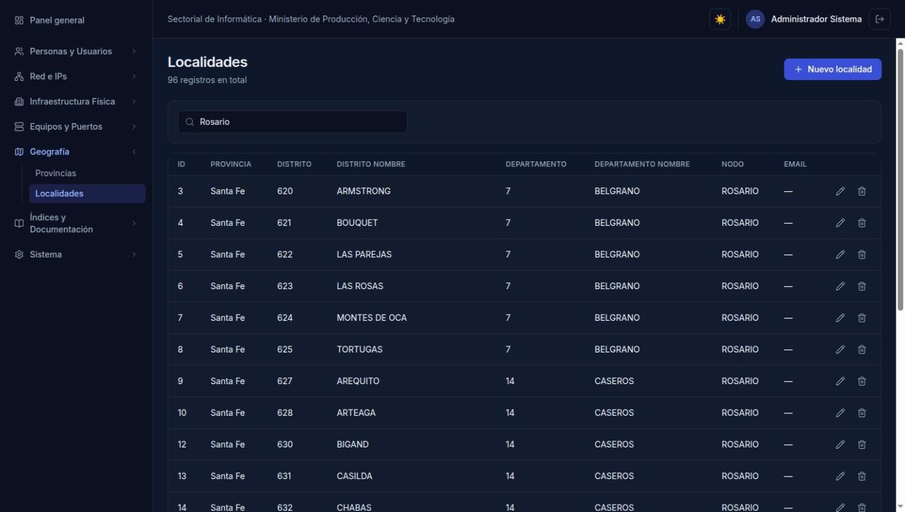
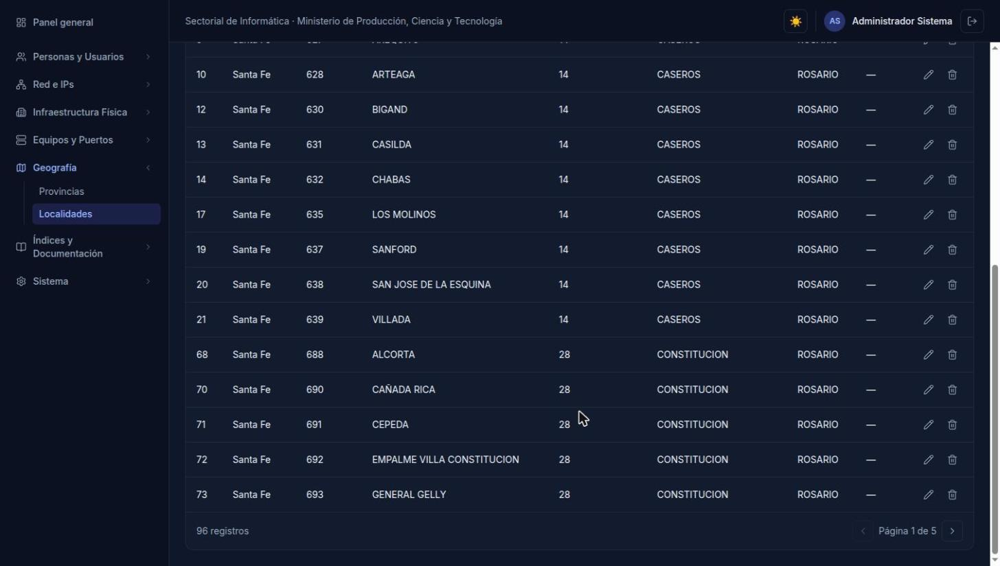

# Repositorio Sectorial — Panel de gestión de inventario informático

> Documento de referencia para la sección **Proyectos** del portafolio.
> Las capturas están en `./capturas/`. Los datos que se ven en pantalla son
> **ficticios**, cargados a propósito para documentar la interfaz.

---

## Ficha rápida (para la tarjeta del portafolio)

| | |
|---|---|
| **Nombre** | Repositorio Sectorial — Panel de gestión |
| **Tipo** | Aplicación web interna (full-stack) |
| **Stack** | Next.js 15 · TypeScript · Prisma 5 · MySQL/MariaDB · Tailwind CSS |
| **Rol** | Desarrollo completo: modelado de datos, backend y frontend |
| **Contexto** | Sectorial de Informática — Ministerio de Producción, Ciencia y Tecnología, Gobierno de Santa Fe |
| **Estado** | Funcional de punta a punta sobre una réplica local; pendiente de pasar a producción |

**Bajada corta (1 línea):**
Panel web que administra el inventario de personas, sectores, oficinas, equipos, IPs y redes de un organismo público, con un CRUD generado automáticamente a partir del esquema real de la base de datos.

**Bajada media (3 líneas):**
Aplicación interna en Next.js 15 + Prisma que reemplaza la carga manual sobre 28 tablas de un sistema de inventario informático. En vez de escribir 28 pantallas a mano, un único motor lee la estructura real de la base y genera listados, búsqueda, alta y edición de forma automática. Incluye autenticación propia compatible con los usuarios ya existentes del sistema legado.

---

## El problema

La Sectorial de Informática del ministerio mantiene un inventario de todo su parque:
quién es cada persona, en qué sector y oficina trabaja, qué equipos tiene asignados,
qué IP usa cada equipo, a qué red pertenece esa IP y en qué puerto de qué switch está
cableado. Todo eso vive en una base MySQL (`mprod_repo`) de **28 tablas de negocio**
detrás de un sistema Symfony heredado.

Dos limitaciones concretas:

1. **No hay acceso a la base de producción.** Es un sistema ministerial: no se puede
   copiar, exportar ni consultar libremente.
2. **El sistema actual obliga a mantener una pantalla por tabla.** Cada campo nuevo
   implica tocar formularios, listados y validaciones a mano.

## Qué construí

### 1. Reconstrucción del esquema por ingeniería inversa

Sin acceso a producción, reconstruí el esquema completo cruzando cuatro fuentes:

- las **30 entidades Doctrine** del código Symfony (`src/Entity/*.php`) — tipos,
  longitudes, nulabilidad, relaciones y valores por defecto;
- el **historial de migraciones realmente aplicado** contra producción, para confirmar
  nombres exactos de columnas y constraints, y los catálogos que corren de verdad
  (que no siempre coinciden con los que ofrecen los *fixtures* del código);
- las **capturas de los formularios reales de alta**, para saber qué campos expone
  cada pantalla y cuáles son obligatorios;
- los **fixtures de datos de referencia** (provincias, localidades, tipos de persona
  y de equipo).

El resultado es un único script SQL re-ejecutable que levanta la base entera. Detalles
que valió la pena resolver bien:

- **Dependencia circular `equipo` ↔ `puerto_red`.** Un equipo apunta al puerto donde
  está cableado, y un puerto apunta al equipo que lo posee. El script crea `equipo`
  sin esa FK, después `puerto_red`, y cierra el círculo con un `ALTER TABLE` final —
  el mismo orden que se usó en producción.
- **Tipos reales vs. tipos declarados.** Algunas columnas están anotadas como `TEXT`
  en Doctrine pero producción las alteró a `LONGTEXT`. Se respetó lo que corre, no lo
  que dice la anotación.
- **Cero datos de negocio inventados.** Solo estructura y catálogos de referencia
  reales; la carga inicial la hace el equipo con datos genuinos.

Verificación: las 30 entidades revisadas campo por campo contra el SQL generado, más
una importación real de prueba en un MariaDB limpio (esquema + catálogos, sin errores).

### 2. El panel web: un CRUD dirigido por metadatos

La decisión de diseño central: **no hay 28 pantallas escritas a mano**.

El esquema de Prisma no se escribió: se generó con `prisma db pull` leyendo la base
real. A partir de ahí, un único motor de metadatos consulta el DMMF de Prisma —la
descripción en runtime del esquema— y deriva solo:

- qué columnas mostrar en el listado y cuáles ocultar;
- qué tipo de input corresponde a cada campo (texto, número, fecha, checkbox, textarea);
- qué campos son obligatorios y cuáles gestiona la base (IDs, timestamps de auditoría);
- qué claves foráneas hay, y por lo tanto qué combos de selección renderizar y con qué
  etiqueta legible mostrar cada opción;
- cómo direccionar registros con **clave primaria compuesta** (las tablas puente
  muchos-a-muchos), que se codifican y decodifican en la URL.

Agregar una tabla al panel es agregar una entrada de metadatos: nombre en español,
grupo del menú y qué campo usar como etiqueta. El listado, la búsqueda, la paginación,
el alta, la edición y los selects de relaciones aparecen solos.

Para los casos que no se pueden inferir del esquema hay una capa fina de override por
campo: un `TEXT` que conviene renderizar como textarea, un campo que no debe aparecer
en el formulario, un texto de ayuda.

### 3. Autenticación compatible con el sistema existente

Sin librería pesada de auth: sesión firmada con **JWT (`jose`)** guardada en una cookie
`httpOnly`, con expiración de 8 horas, validada por middleware en todas las rutas salvo
el login.

La parte interesante es la compatibilidad: las contraseñas de la tabla `user` heredada
están hasheadas con **bcrypt**, así que el login valida contra esos hashes tal cual.
Un usuario del sistema Symfony entra al panel nuevo con sus mismas credenciales, sin
migración ni reseteo.

Las mutaciones pasan todas por **Server Actions** de Next.js: no hay endpoints REST
propios que mantener, y los errores de base (violación de unicidad, FK con registros
dependientes) se traducen a mensajes en castellano entendibles por el usuario final.

---

## Capturas

### Login

Autenticación contra la tabla `user` existente. La sesión se firma con JWT y se guarda
en una cookie `httpOnly`; el middleware protege todas las rutas menos esta.

### Panel general

Contadores en vivo por grupo temático, calculados sobre las 28 tablas. Cada línea es un
acceso directo al listado correspondiente.

Modo claro y oscuro, con la preferencia persistida entre navegaciones.

### Listados generados automáticamente

Listado de equipos. Las columnas de clave foránea (`oficina_id`, `responsable_id`,
`sector_id`, `tipo_equipo_id`) no muestran el número: se resuelven a la etiqueta legible
de la fila relacionada.

Direcciones IP con su red y su estado de actividad (`ASIGNADA`, `LIBRE`, `RESERVADA`,
`DESCUBIERTA`, `PENDIENTE USO`, …), que es lo que sincroniza el proceso de escaneo de red.

Sectores. La tabla se auto-referencia para formar el árbol organizacional, y el motor
resuelve la relación padre igual que cualquier otra FK.

### El caso del formulario dinámico

`tipo_equipo` es la tabla que **configura el formulario de alta de equipos**: cada
columna `show_*` decide si ese campo aparece y si es obligatorio para ese tipo puntual
(una impresora puede no requerir IP; un switch sí).

La pantalla de edición de esa configuración.

El formulario de alta resultante: combos poblados desde las tablas relacionadas,
tipos de input inferidos del esquema, y campos obligatorios marcados.

Edición de un reporte dinámico —cada fila define una consulta SQL ejecutable desde el
menú—. Se ven los overrides de campo: `querysql` y `roles` como textarea, texto de ayuda
y marcadores de obligatoriedad.

### Búsqueda y paginación

Búsqueda genérica: filtra sobre todos los campos de texto de la tabla, sin configuración
por entidad. Acá, 96 de 363 localidades coinciden con "Rosario".

Paginación del lado del servidor, aplicada sobre el resultado filtrado.

---

## Stack y decisiones

| Decisión | Por qué |
|---|---|
| **Next.js 15 (App Router)** | Front y back en un solo proyecto; Server Components para leer la base sin exponer una API intermedia. |
| **Server Actions para todas las mutaciones** | Un único camino de escritura, sin endpoints REST propios que mantener ni sincronizar. |
| **Prisma con `db pull`** | El esquema se deriva de la base real, no se escribe a mano: no puede quedar desincronizado. El DMMF además es lo que alimenta el CRUD genérico. |
| **CRUD dirigido por metadatos** | 28 tablas con la misma forma de interacción. Escribirlas a mano habría sido 28 veces el mismo código y 28 lugares donde equivocarse. |
| **Auth propia con `jose` + `bcryptjs`** | Compatibilidad exacta con los hashes bcrypt del sistema legado, sin migrar usuarios ni sumar una dependencia grande. |
| **Tailwind CSS** | Paleta propia, modo claro/oscuro, sin arrastrar un framework de componentes entero. |

## Números

- **28 tablas** de negocio administradas desde el panel
- **30 entidades** Doctrine revisadas campo por campo para reconstruir el esquema
- **6 grupos** temáticos en el menú (Personas, Red e IPs, Infraestructura, Equipos, Geografía, Índices, Sistema)
- **387 registros** de catálogos geográficos reales cargados (24 provincias, 363 localidades)
- **0 pantallas** escritas a mano por tabla

## Estado y próximos pasos

- Probado de punta a punta: login real contra hashes bcrypt existentes, y alta y edición
  reales contra la réplica.
- **Pendiente antes de producción:** control de acceso por rol (hoy se valida que el
  usuario exista, esté activo y tenga la contraseña correcta, pero no se restringe por
  `ROLE_ADMIN` como sí hace el sistema Symfony); rotar el secreto de sesión; y apuntar
  la conexión a la base real.

---

### Nota sobre privacidad

Este proyecto trabaja sobre datos de un organismo público. **No se muestra ni se
publica ninguna información real**: la base que se ve en las capturas es una réplica
local del *esquema*, y todas las personas, equipos, IPs, sectores y oficinas que
aparecen son datos ficticios generados para documentar la interfaz. Los únicos datos
reales cargados son catálogos geográficos públicos (provincias y localidades).
